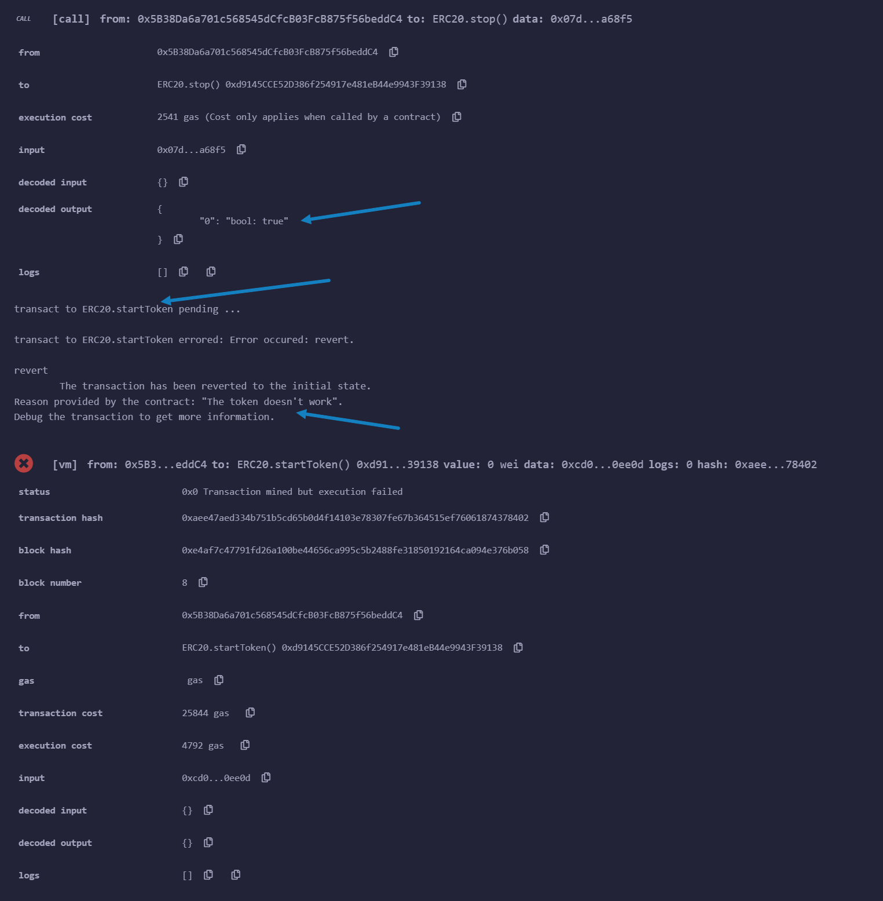

# АУДИТ

`Кунин Илья Евгеньевич, БПИ205`

### Уязвимость №1

|        Пункт        |                        Значение                         |
|:-------------------:|:-------------------------------------------------------:|
| Название уязвимости |                     changeCreator()                     |
|  Краткое описание   |       Любой пользователь можем заменить _creator        |
| Как воспользоваться |                 Вызвать changeCreator()                 |
|  Какие последствия  |    Подмена _creator и исполнению функций от его лица    |
|    Как исправить    |      Строка 32, заменить checkStop на onlyCreator       |
|  Proof of Concept   | Тест creator_1 + скрин из Remix |

### Уязвимость №2

|        Пункт        |                             Значение                             |
|:-------------------:|:----------------------------------------------------------------:|
| Название уязвимости |                       decreaseAllowance()                        |
|  Краткое описание   |     Некорректная работа, allowance растет, а не уменьшается      |
| Как воспользоваться |                   Вызвать decreaseAllowance()                    |
|  Какие последствия  |                 Некорректное значение allowance                  |
|    Как исправить    |                   Строка 131, заменить + на -                    |
|  Proof of Concept   | Тест decrease_allowance + скрин из Remix |

### Уязвимость №3

|        Пункт        |                         Значение                         |
|:-------------------:|:--------------------------------------------------------:|
| Название уязвимости |                       stopToken()                        |
|  Краткое описание   |            Кто угодно может остановить токен             |
| Как воспользоваться |                   Вызвать stopToken()                    |
|  Какие последствия  |          Нежелательные остановки работы токена           |
|    Как исправить    | Строка 43, заменить модификатор checkStop на onlyCreator |
|  Proof of Concept   |          Скрин из Remix          |

### Уязвимость №4

|        Пункт        |                 Значение                  |
|:-------------------:|:-----------------------------------------:|
| Название уязвимости |               startToken()                |
|  Краткое описание   | Некорректная работа, токен не запускается |
| Как воспользоваться |    Вызвать stopToken() и startToken()     |
|  Какие последствия  | Остановленный токен невозможно запустить  |
|    Как исправить    |  Строка 47, убрать модификатор checkStop  |
|  Proof of Concept   |  Скрин из Remix   |

### Уязвимость №5

|        Пункт        |                Значение                 |
|:-------------------:|:---------------------------------------:|
| Название уязвимости |               _approve()                |
|  Краткое описание   |    Закрытый метод является публичным    |
| Как воспользоваться |           Вызвать _approve()            |
|  Какие последствия  |      Подмена значений _allowances       |
|    Как исправить    | Строка 173, заменить public на internal |
|  Proof of Concept   | Скрин из Remix  |
